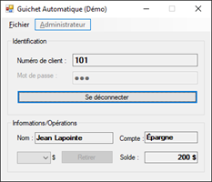
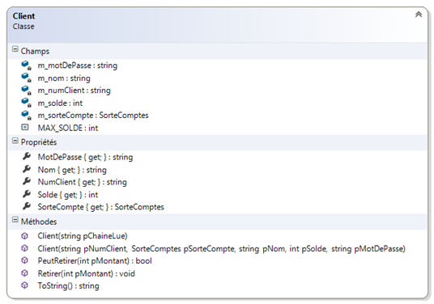
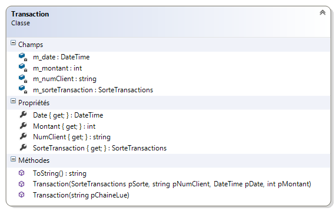
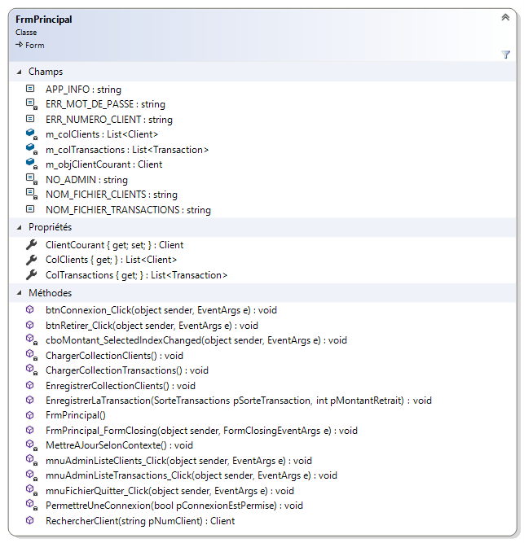
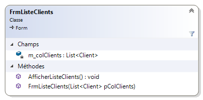
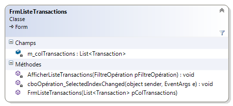
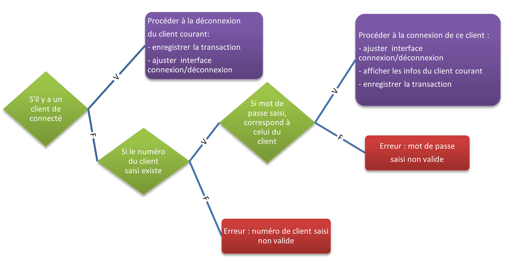

# Bank Cashing System Simulator (FRENCH ONLY)

Simulates simple banking transactions with authentication and verifications to ensure the app does not crash.

## Objectives 

---
*	Créer et utiliser des classes et des sous-formulaires. 
*	Redéfinir la méthode ToString d’un objet.
*	Utiliser des types par énumération. 
*	Lancer des Exceptions
*	Valider des données et utiliser le contrôle ErrorProvider
*	Afficher des objets dans une ListView. 
*	Manipuler des dates de type DateTime.


## Description

---

Simuler l’utilisation d’un guichet automatique. Un client peut se connecter avec son numéro et son mot de passe. Il peut retirer de l’argent si son solde le permet. L’administrateur du guichet peut visualiser la liste des clients ou la liste des transactions effectuées sur le guichet.


## INTERFACE 

---

Voici un exemple où le numéro de client était valide et donc a pu se connecter:


<p align="center">
  
</p>


## Classes

---
Le programme utilise plusieurs classes pour le fonctionnement. Voici le diagramme de chaque classe:

* [Client](./AppGuichet/Client.cs)
<p align="center">
  
</p>

* [Transaction](./AppGuichet/Transaction.cs)
<p align="center">
  
</p>

* [FormPrincipal](./AppGuichet/FrmPrincipal.cs)
<p align="center">
  
</p>

* [FormListeClients](./AppGuichet/FrmListeClients.cs)
<p align="center">
  
</p>

* [FormListeTransactions](./AppGuichet/FrmListeTransactions.cs)
<p align="center">
  
</p>

##  Authentication

---

```csharp
// Messages d'erreur
errIdentification.SetError(txtMotDePasse, "");
errIdentification.SetError(txtNumClient, "");

// Vérifier si les champs du Form ne sont pas vides.

if (m_objClientCourant != null)
{
    // Déconnexion
    PermettreUneConnexion(true);
    EnregistrerLaTransaction(SorteTransactions.Déconnexion, 0);
    m_objClientCourant = null;

}
else
{
    // Connexion
    
    // Rechercher le client dans la base de données
    m_objClientCourant = RechercherClient(txtNumClient.Text);

    // Checker si l'utilisateur à été trouvé
    if (m_objClientCourant != null)
    {

        // Checker si son mot de passe est correct
        if (txtMotDePasse.Text == m_objClientCourant.MotDePasse)
        {
            errIdentification.SetError(txtMotDePasse, ""); // No error
            PermettreUneConnexion(false);

            txtNom.Text = m_objClientCourant.Nom;
            txtSolde.Text = m_objClientCourant.Solde.ToString("C0");
            txtSorteCompte.Text = m_objClientCourant.SorteCompte.ToString();

            cboMontant.SelectedIndex = -1;
            //btnRetirer.Enabled = true;

            EnregistrerLaTransaction(SorteTransactions.Connexion, 0);
        }
        else
        {
            m_objClientCourant = null;
            txtMotDePasse.Clear();
            txtMotDePasse.Focus();
            errIdentification.SetError(txtMotDePasse, ERR_MOT_DE_PASSE);
        }

    }
    // Quoi faire si l'utilisateur n'est pas trouvé
    else 
    {
        errIdentification.SetError(txtNumClient, ERR_NUMERO_CLIENT);
        txtNumClient.Clear();
        txtNumClient.Focus();
    } 
        
}
MettreAJourSelonContexte();
```

### ***Diagramme:***

<p align="center">
  
</p>


## Permissions du panneau en mode ADMIN

---

* Le menu Administrateur/Liste de clients est disponible pour l’administrateur seulement. On affiche la collection des clients dans le sous-formulaire FrmListeClients. Voir la démo.
* Le menu Administrateur/Liste des transactions est disponible pour l’administrateur seulement. On affiche la collection filtrée des transactions en ordre décroissant de date dans le sous-formulaire FrmListeTransactions.


<p align="center">
  
</p>


## Retrait d'argent
 
 ---

 Ce bouton est disponible si le client peut retirer de l’argent dans son compte. L’administrateur ne peut jamais retirer de l’argent. Lorsqu’il y a un retrait, on enregistre le retrait dans le fichier des transactions : sorte de transaction, date et heure actuelle, numéro du client et montant du retrait.
 Voici un exemple:
 
> ***2,102,2010-03-09 14:08:51,25***


## *Remarque:* 

---

 > ***Même si ce travail émule le fonctionnement d’un guichet automatique, plusieurs éléments ne sont pas réalistes. Par exemple si une panne de courant survenait les soldes des clients seraient à valider, par contre on pourrait utiliser le fichier des transactions pour rétablir la situation. Normalement les mots de passe ne sont pas lisible par l’administrateur, ils sont habituellent encrytés.***


